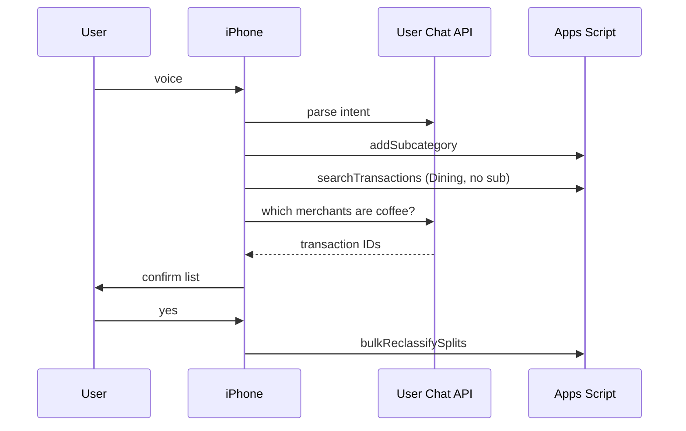

# Budget-Bunny Sheet API

Version **1.5** — categories + subcategories; MonthlySummary spent from Splits.

Every POST includes `"token": "your-api-token"`.

---

## getCategories

```json
{
  "token": "...",
  "action": "getCategories"
}
```

**Response:**

```json
{
  "categories": [
    {
      "name": "Groceries",
      "group": "Needs",
      "color": "#50C878",
      "context": "Food bought to cook at home",
      "subcategories": [
        { "name": "Costco", "context": "Costco / warehouse club grocery runs" },
        { "name": "Trader Joes", "context": "Trader Joes grocery runs" }
      ]
    },
    {
      "name": "Rent",
      "group": "Needs",
      "color": "#4A90D9",
      "context": "Housing / rent payments",
      "subcategories": []
    }
  ]
}
```

`context` comes from the **Context** column on **Categories** / **Subcategories**. Pass it to the Chat API so the model knows what belongs in each bucket.

---

## getBalances

Spent per main category for the month in Dashboard!B3 (from **MonthlySummary**, which SUMs **Splits**).

```json
{
  "token": "...",
  "action": "getBalances"
}
```

**Response:**

```json
{
  "balances": [
    {
      "category": "Groceries",
      "group": "Needs",
      "spent": 45
    }
  ]
}
```

Paid reimbursements are excluded from spent.

---

## addTransaction

```json
{
  "token": "...",
  "action": "addTransaction",
  "data": {
    "date": "2026-06-10",
    "merchant": "Costco",
    "amount": 45,
    "paymentMethod": "Card",
    "source": "voice",
    "splits": [
      {
        "category": "Groceries",
        "subcategory": "Costco",
        "amount": 45
      }
    ]
  }
}
```

| Split field | Required | Notes |
|-------------|----------|-------|
| `category` | yes | Main category from **Categories** tab |
| `subcategory` | no | Must exist under that parent in **Subcategories** |
| `amount` | yes | Must sum to transaction total |
| `reimbursementStatus` | no | `Pending payment` (counts until paid back) or `Paid` (excluded from spent). Blank = normal expense. |
| `notes` | no | Per-split context for matching reimbursements (e.g. `Alex — food`). Shown on **Splits** and **Ledger**. |

**Merchant:** use a real store name only. If the user did not name a venue, send `"Not specified"` and put context in `notes` / split `notes`.

### Reimbursement flow

**1. Pay for group** — friends' portion uses `reimbursementStatus: "Pending payment"`:

```json
"splits": [
  { "category": "Dining", "amount": 50 },
  { "category": "Dining", "amount": 70, "reimbursementStatus": "Pending payment" }
]
```

**2. Friend pays back** — mark the pending split Paid:

```json
{
  "action": "markReimbursementPaid",
  "data": { "amount": 70, "payerName": "James", "keywords": ["lunch", "Alex"] }
}
```

`markReimbursementPaid` searches the **Splits** tab for rows with **Reimbursement Status = Pending payment**, then filters by amount, payer name (in split/transaction Notes), keywords (in Notes + merchant + category), and optionally merchant (ignored when generic / `Not specified`). Matching rows are set to **Paid**.

### searchPendingReimbursements

```json
{
  "action": "searchPendingReimbursements",
  "data": { "merchant": "South Bay" }
}
```

Main-only example:

```json
"splits": [{ "category": "Rent", "amount": 1500 }]
```

---

## addSubcategory

Create a subcategory under a main category.

```json
{
  "token": "...",
  "action": "addSubcategory",
  "data": {
    "parentCategory": "Dining",
    "subcategory": "Coffee"
  }
}
```

---

## searchTransactions

Find past splits for LLM review or keyword pre-filter.

```json
{
  "token": "...",
  "action": "searchTransactions",
  "data": {
    "mainCategory": "Dining",
    "missingSubcategoryOnly": true,
    "keywords": ["coffee", "starbucks", "cafe"]
  }
}
```

Omit `keywords` to return all matching rows (e.g. every Dining split with no sub) for the LLM to classify.

**Response:**

```json
{
  "transactions": [
    {
      "transactionId": "A1B2C3D4",
      "splitRow": 5,
      "date": "2026-05-12",
      "merchant": "Starbucks",
      "notes": "",
      "mainCategory": "Dining",
      "subcategory": "",
      "amount": 6.5
    }
  ],
  "count": 1
}
```

---

## bulkReclassifySplits

After user confirms on phone, apply subcategory to existing rows.

```json
{
  "token": "...",
  "action": "bulkReclassifySplits",
  "data": {
    "updates": [
      {
        "transactionId": "A1B2C3D4",
        "mainCategory": "Dining",
        "subcategory": "Coffee"
      }
    ]
  }
}
```

---

## reclassifyByKeywords

Simple path without LLM — keyword match only.

```json
{
  "token": "...",
  "action": "reclassifyByKeywords",
  "data": {
    "parentCategory": "Dining",
    "subcategory": "Coffee",
    "keywords": ["coffee", "starbucks", "dunkin", "cafe", "latte"],
    "missingSubcategoryOnly": true
  }
}
```

Creates the sub if needed, searches, and updates all keyword matches in one step.

---

## Voice command flow (iPhone)

Example: *"Add a subcategory under Dining called Coffee, and move coffee-related past entries there."*



The **LLM runs on the phone** (user's API key). The sheet only stores data and applies confirmed updates.

---

## Errors

```json
{ "error": "Unknown subcategory \"Costco\" under \"Groceries\". Check Subcategories tab." }
{ "error": "Unknown main category \"Food\". Must match Categories tab exactly." }
```
